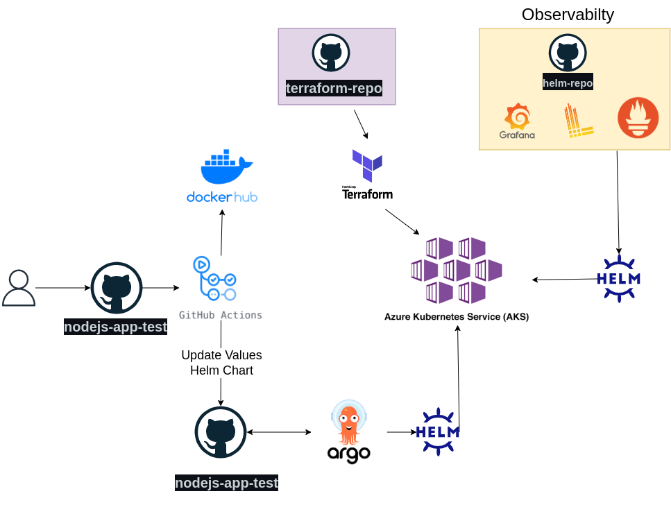

# Ília challenge

- Application NodeJS + Express (with Helm Chart)
- Kubernetes Cluster using terraform  -  We choose the Azure AKS
- Observability Infraestructure with Grafana, Prometheus and Loki (All of them in helm chart)
- CI/CD infraestructure using GitHub Actions and Argo CD.

# Challenge Diagram

# Cluster AKS

## Terraform repository

https://github.com/jessefs/terraform-repo

## Show Ingress DNS Name

az aks show --resource-group gr_test_k8s --name cluster_test_aks --query addonProfiles.httpApplicationRouting.config.HTTPApplicationRoutingZoneName -o table

# Observability Infraestructure

## Helm Repo

https://github.com/jessefs/helm-repo